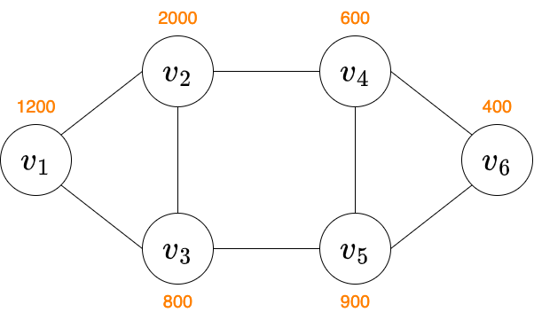

# Electoral Districting Problem Dataset

選挙区割問題のデータセットです．

## 問題文
$N$ 頂点 $M$ 辺の連結な単純無向グラフ $G$ が与えられる．グラフの頂点にはそれぞれ $1$ から $N$ までの番号が振られている．それぞれの頂点には重みが存在し，対応する頂点番号を添字として $w_1, ..., w_N$ と定める．$i$ 番目の辺は，頂点 $a_i$ と $b_i$ を双方向に結ぶことを表している．

上述のグラフを $K$ 個の部分グラフ $G'_1,...,G'_K$ に分割し，各部分グラフに含まれる頂点集合を求めよ．分割した部分グラフは，以下の条件を満たす必要がある．

- 部分グラフの総数は $K$ である
- 全ての部分グラフは連結グラフである
- グラフ $G$ の各頂点は**いずれか1つ**の部分グラフに含まれる

また，それぞれの部分グラフの頂点の重みの和はできるだけ均等になるように構成したい．
部分グラフの頂点の重みの和の最大値を最小値で割った商が小さいほど良いグラフ分割とする．

## 入力
`./data/{都道府県id}/in.dat` ファイルに入力データが存在する．入力データの形式は以下の通り．
```
N M K
w_1 ... w_N
a_1 b_1
.
.
.
a_M b_M
```
## 出力
頂点番号順に各頂点が属している部分グラフ $G'$ の添字を1行で出力せよ．値の範囲は $1\sim K$ となることに注意．（出力例を参照）

## 得点
**条件を満たしていないものは得点がつかない**．条件を満たしている場合，部分グラフに含まれる頂点の重みの和の最大値を $W_{max}$ , 最小値を $W_{min}$ と定め，得点(Score)は $$  \mathrm{Score} = \lfloor \frac{W_{max}}{W_{min}} \times 10000 \rfloor - 10000 $$ とする．Score は小さければ良く，0に近ければ近いほど良いグラフ分割となる．

## 入力例
サンプルデータ `./data/0/in.dat` を使用
```
6 8 3
1200 2000 800 600 900 400
1 2
1 3
2 3
2 4
3 5
4 5
4 6
5 6
```


入力例を図示するとこのようになる．頂点 $v$ の添字が頂点番号，橙字が頂点の重みを表す．

## 出力例
```
1 2 1 3 3 3
```
この場合，頂点集合は $ \{1,3\}, \{2\},\{4,5,6\} $ であり，部分グラフの頂点重みの和はそれぞれ $2000, 2000, 1900$ となる．よってスコアは，$W_{max}=1900,$ $W_{min}=2000$ より，$526$ ($5.26\%$の誤差)となる．
### 誤った出力例
```
1 1 2 2 3 3
```
部分グラフ $G'_2$ の頂点集合 $\{3,4\}$ は連結でないため，スコアはつかない．

## ツール
`scoring.py` :　スコアの計算を行うプログラム．`NetworkX` が必要．

NetworkXの導入
```
$ pip install networkx
```
実行例
```
$ python scoring.py
都道府県idを入力:0
部分グラフの頂点集合を入力
1 2 1 3 3 3
---------------
W_max: 2000
W_min: 1900
score: 526
---------------
```

## 補足
都道府県に割り当てられているIDは[こちら](https://www.mhlw.go.jp/topics/2007/07/dl/tp0727-1d.pdf)を参照

データは今後も更新予定